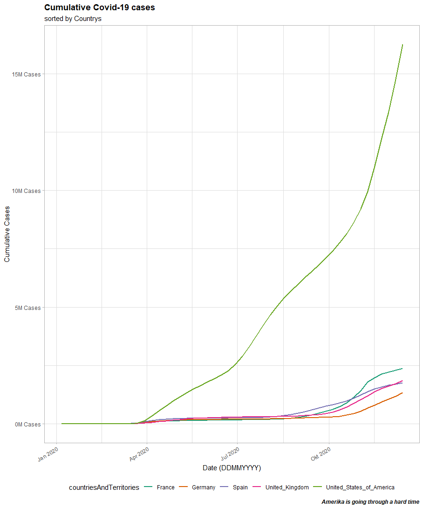

```{r setup, include=FALSE}
knitr::opts_chunk$set(message=FALSE,warning=FALSE, cache=TRUE)
```

# Challenge 1


## Barplot


## Sales by location and year


The following section shows the used code to create the given bar plots.

```
#Challenge 1
library(tidyverse)
library(readxl)

bikes_tbl <- read_excel(path = "DS_101/00_data/01_bike_sales/01_raw_data/bikes.xlsx")
orderlines_tbl <-read_excel("DS_101/00_data/01_bike_sales/01_raw_data/orderlines.xlsx")
bikeshops_tbl <-read_excel("DS_101/00_data/01_bike_sales/01_raw_data/bikeshops.xlsx")

# 3.0 Examining Data ----

# 4.0 Joining Data ----

temp <- left_join(orderlines_tbl, bikes_tbl, by = c("product.id"="bike.id"))


bike_orderlines_joined_tbl <- orderlines_tbl %>% 
  left_join(bikes_tbl, by=c("product.id"="bike.id")) %>%
  left_join(bikeshops_tbl, by = c("customer.id" = "bikeshop.id"))

bike_orderlines_joindes_tbl %>% glimpse()


bike_orderlines_joined_tbl %>% 
  select(category) %>%
  filter(str_detect(category, "^Mountain")) %>% 
  unique()

# All actions are chained with the pipe already. You can perform each step separately and use glimpse() or View() to validate your code. Store the result in a variable at the end of the steps.
bike_orderlines_wrangled_tbl <- bike_orderlines_joined_tbl %>%
  # 5.1 Separate category name
  separate(col    = category,
           into   = c("category.1", "category.2", "category.3"),
           sep    = " - ") %>%
  
  # 5.2 Add the total price (price * quantity) 
  # Add a column to a tibble that uses a formula-style calculation of other columns
  mutate(total.price = price * quantity) %>%
  
  # 5.3 Optional: Reorganize. Using select to grab or remove unnecessary columns
  # 5.3.1 by exact column name
  select(-...1, -gender) %>%
  
  # 5.3.2 by a pattern
  # You can use the select_helpers to define patterns. 
  # Type ?ends_with and click on Select helpers in the documentation
  select(-ends_with(".id")) %>%
  
  # 5.3.3 Actually we need the column "order.id". Let's bind it back to the data
  bind_cols(bike_orderlines_joined_tbl %>% select(order.id)) %>% 
  
  # 5.3.4 You can reorder the data by selecting the columns in your desired order.
  # You can use select_helpers like contains() or everything()
  select(order.id, contains("order"), contains("model"), contains("category"),
         price, quantity, total.price,
         everything()) %>%
  
  # 5.4 Rename columns because we actually wanted underscores instead of the dots
  # (one at the time vs. multiple at once)
  rename(bikeshop = name) %>%
  set_names(names(.) %>% str_replace_all("\\.", "_"))

##########################################

# 6.0 Business Insights ----
# 6.1 Sales by State ----
library(lubridate)
# Step 1 - Manipulate
sales_by_state_tbl <- bike_orderlines_wrangled_tbl %>%
  
  # wähle Werte aus
  select(location, total_price) %>% 
  #split values
    separate(col="location",
    into = c("city", "state"),
    sep =", ",
    convert =T) %>%
  
  
  group_by(state,city) %>%
  summarize(sales= sum(total_price)) %>%
  
  mutate(sales_text = scales::dollar(sales, big.mark = ".",
                                     decimal.mark=",",
                                     prefix="",
                                     suffix = " €"))
#########

state_sale_tbl <- sales_by_state_tbl %>%
  select(state, sales)%>%
  group_by(state) %>%
  summarize(state_sale = sum(sales)) %>%
  arrange(state_sale) %>%
  mutate(sales_text = scales::dollar(state_sale, big.mark = ".", 
                                     decimal.mark = ",", 
                                     prefix = "", 
                                     suffix = " €"))


##plot

state_sale_tbl %>%
  
  # Setup canvas with the columns year (x-axis) and sales (y-axis)
  ggplot(aes(x = state, y = state_sale)) +
  
  # Geometries
  geom_col(fill = "#2DC6D6") + # Use geom_col for a bar plot
  geom_label(aes(label = sales_text)) + # Adding labels to the bars
  #geom_smooth(method = "lm", se = FALSE) + # Adding a trendline
  
  # Formatting
  #scale_y_continuous(labels = scales::dollar) + # Change the y-axis. 
  # Again, we have to adjust it for euro values
  scale_y_continuous(labels = scales::dollar_format(big.mark = ".", 
                                                    decimal.mark = ",", 
                                                    prefix = "", 
                                                    suffix = " €")) +
  labs(
    title    = "Revenue by state",
    x = "", # Override defaults for x and y
    y = "Revenue"
  )+ 
  theme(axis.text.x = element_text(angle = 45, hjust = 1)) 

# Sales by location and year

sales_by_state_year_tbl <- bike_orderlines_wrangled_tbl %>%
  select(order_date,total_price, location) %>%
  separate(col="location",
           into = c("city", "state"),
           sep =", ",
           convert =T) %>%
  mutate(year=year(order_date))%>%
  group_by(state, year) %>%
  select(year,total_price, state) %>%
  summarize(state_sale = sum(total_price))
  
  
  sales_by_state_year_tbl %>%
  
  # Set up x, y, fill
  ggplot(aes(x = year, y = state_sale, fill = state)) +
  
  # Geometries
  geom_col() + # Run up to here to get a stacked bar plot
  
  # Facet
  facet_wrap(~ state) +
  
  # Formatting
  scale_y_continuous(labels = scales::dollar_format(big.mark = ".", 
                                                    decimal.mark = ",", 
                                                    prefix = "", 
                                                    suffix = " €")) +
  labs(
    title = "Sales by location and year",
    subtitle = "12 locations and 5 years",
    fill = "Region" # Changes the legend name
  )+ 
    theme(axis.text.x = element_text(angle = 45, hjust = 1))+
    theme(legend.position = "none")
```

# Challenge 2

## Weather-API

For my API based challenge, I chose openweathermap API and gather data from five cities

As result I get the following output:

```
  city      lon   lat sky     description             temp_Kelvin
  <chr>   <dbl> <dbl> <chr>   <chr>                         <dbl>
1 London  -0.13  51.5 Rain    moderate rain                  286.
2 London  -0.13  51.5 Rain    moderate rain                  286.
3 Hamburg 10     53.6 Rain    light rain                     280.
4 Bremen   8.81  53.1 Rain    light rain                     280.
5 Paris    2.35  48.8 Drizzle light intensity drizzle        286.
6 Paris    2.35  48.8 Mist    mist                           286.
7 Moscow  37.6   55.8 Clouds  overcast clouds                274.
```
The output is generated by the following code:
```
library(httr)
library(glue)
library(jsonlite)
library(tidyverse)
library(dplyr)

# more citys are possible, bur the free api should not be stressed out. 
# only 40 request per hour

city_names <- c("London", "Hamburg", "Bremen", "Paris", "Moskau")

#first this is null, to check later in the code, for merging tibbles
final_tibble = NULL

#function for the weather api
weather_api_foo <- function(city){
  API_key <- "4ecc371b838af43c32214d58d6cbc46b"
  resp <- GET(glue("https://api.openweathermap.org/data/2.5/weather?q={city}&appid={API_key}"))
  
  response_body<-rawToChar(resp$content)
  weather_list <- fromJSON(response_body)
  
  #clean data
  cords<-as_tibble(weather_list[["coord"]])
  weather<-as_tibble(weather_list[["weather"]])%>% rename(sky=main)
  wind<-as_tibble(weather_list[["wind"]])
  city<-as_tibble(weather_list[["name"]]) %>% rename(city=value)
  temp<-as_tibble(weather_list[["main"]][["temp"]]) %>% rename(temp_Kelvin=value)
  
  #merge data to tibble
  a <- c(cords,weather,wind,city,temp)
  
  full_tibble <- as_tibble(a) %>% 
    select("city","lon", "lat", "sky", "description","temp_Kelvin")
  
  #return value
  return(full_tibble)
}


#Loop to check for all the given citys
for(name in city_names){
  temp <- weather_api_foo(name)
  
  #merge tibbles
  
  if(is.null(final_tibble)){
    final_tibble <- temp
  }
  
  if(is.null(final_tibble) == FALSE){
    final_tibble <- bind_rows(final_tibble, temp)
  }
}
```


## Web-Scrapping
My result for web scrapping is based on the rosebikes section for mounten bikes
as a result I get:
```
  bike              price         
  <chr>             <chr>         
1 GROUND CONTROL    "ab 1.699,00 "
2 ROOT MILLER       "ab 1.999,00 "
3 PIKES PEAK        "ab 3.099,00 "
4 THE BRUCE         ""            
5 COUNT SOLO        ""            
6 PSYCHO PATH       "ab 1.849,00 "
7 THRILL HILL       "ab 2.599,00 "
8 THRILL HILL TRAIL "ab 2.899,00 "
9 SOUL FIRE         "ab 2.149,00 "
```
The empty spaces result from newly announced models, where no price is given right now
The results where gathered by the following code:

```
## create a small database of at least one category
## database content: model names and price for at least on category

library(tidyverse) # Main Package - Loads dplyr, purrr, etc.
library(rvest)     # HTML Hacking & Web Scraping
library(xopen)     # Quickly opening URLs
library(jsonlite)  # converts JSON files to R objects
library(glue)      # concatenate strings
library(stringi)   # character string/text processing

url_mtb <- "https://www.rosebikes.de/fahrr%C3%A4der/mtb"

#xopen(url_mtb)

html_mtb <- read_html(url_mtb)

bike_names_tbl <- html_mtb %>%
  html_nodes(css = ".catalog-category-bikes__title-text") %>%
  html_text() %>%
  stringr::str_replace_all("\n", "") %>%
  as_tibble() %>% 
  rename(name=value)

bike_price_tbl <- html_mtb %>%
  html_nodes(css = ".catalog-category-bikes__price-title") %>%
  html_text() %>%
  stringr::str_replace_all("\n", "") %>%
  stringr::str_replace_all("\200", "") %>%
  as_tibble() %>% 
  rename(name=value)

full_tibble <- bind_cols(bike_names_tbl, bike_price_tbl)

full_tibble
```


# Challenge 3

## Patent Dominance

```
assignee <- fread("assignee.tsv")
class(assignee)
setDT(assignee)

patent_assignee <- fread("patent_assignee.tsv")
class(patent_assignee)
setDT(patent_assignee)

combined_data <- merge(x = assignee, y = patent_assignee, 
                       by.x= "id",
                       by.y= "assignee_id", 
                       all.x = TRUE, 
                       all.y = FALSE)
temp <- combined_data[!is.na(patent_id), .N, by= organization]
temp[order(-N)] %>% head(n=11)
```

My answer is seen below, but I'm not sure, what happened to the 4th place


```
 1: International Business Machines Corporation 139091
 2:               Samsung Electronics Co., Ltd.  93561
 3:                      Canon Kabushiki Kaisha  75909
 4:                                              73070
 5:                            Sony Corporation  54342
 6:                    Kabushiki Kaisha Toshiba  49442
 7:                    General Electric Company  47121
 8:                               Hitachi, Ltd.  45374
 9:                           Intel Corporation  42156
10:                             Fujitsu Limited  37196
11:   Hewlett-Packard Development Company, L.P.  35572
```
Since Number 4 was a bit of a head scratching, I thought about a single person with that many patents.

So I did my counting by:

```
temp <- combined_data[!is.na(patent_id), .(.N), by= .(name_last, name_first)]
temp[order(-N)] %>% head(n=10)
```
and got this:

```
 1:                       6716173
 2: Stahlecker       Hans     247
 3: Stahlecker      Fritz     227
 4:       Ohmi   Tadahiro     215
 5:       Berg      Lloyd     130
 6:    Goodman Sheldon H.     121
 7:    Fogarty  Thomas J.      88
 8:      Stihl    Andreas      84
 9:       List       Hans      78
10:      Zhang    Guobiao      73
```
as we can see her, most patents belong to a company, but not all and the combined non company patents should make up the 4th place

## Recent patent activity

patent id granted b year. Best guess from my side, that an id is only given, when it exists, so my answer is:

```
#load patents.tsv

#Table of entrys
col_types <- list(
  id = col_character(),
  type = col_character(),
  number = col_character(),
  country = col_character(),
  date = col_date("%Y-%m-%d"),
  abstract = col_character(),
  title = col_character(),
  kind = col_character(),
  num_claims = col_double(),
  filename = col_character(),
  withdrawn = col_double()
)

#reading in the file
patent_tbl <- vroom(
  file       = "patent.tsv", 
  delim      = "\t", 
  col_names  = names(col_types),
  col_types  = col_types,
  na         = c("", "NA", "NULL")
)

#merge all three tables by company and patent id

combined_data_2 <- merge(x = assignee, y = patent_assignee, 
                       by.x= "id",
                       by.y= "assignee_id", 
                       all.x = TRUE, 
                       all.y = FALSE)
combined_data_tbl <- merge(x = combined_data_2, y = patent_tbl, 
                         by.x= "patent_id",
                         by.y= "id", 
                         all.x = TRUE, 
                         all.y = FALSE)

#spill out and count for 2019

temp <- combined_data_tbl[!is.na(patent_id) & year(date)==2019, .N, by= organization]
temp[order(-N)] %>% head(n=11)

```

and again, we have a non company entry, which should belong to single persons too

```
1: International Business Machines Corporation 9265
 2:               Samsung Electronics Co., Ltd. 7205
 3:                      Canon Kabushiki Kaisha 3595
 4:                           Intel Corporation 3526
 5:                         LG Electronics Inc. 3314
 6:         Microsoft Technology Licensing, LLC 3106
 7:                                  Apple Inc. 2817
 8:                                             2744
 9:               Ford Global Technologies, LLC 2624
10:                   Amazon Technologies, Inc. 2533
11:               Huawei Technologies Co., Ltd. 2454
```

## inovative tech sector

```
#read in file
uspc <- fread("uspc.tsv")
class(uspc)
setDT(uspc)

uspc_main_class_id_tbl <-  uspc[,.N, by = mainclass_id]
uspc_main_class_id_tbl[order(-N)]

#combine into the previous files
combined_data_tbl_3 <- merge(x = combined_data_tbl, y = uspc, 
                           by.x= "patent_id",
                           by.y= "patent_id", 
                           all.x = TRUE, 
                           all.y = FALSE)

#try to bring the data down to the answer
answer <- combined_data_tbl_3[!is.na(mainclass_id), .N, by = .(mainclass_id, organization)]
answer <- answer[order(-N)]%>% head(n=11)
answer <- answer[1:10]
answer <- answer[, .N, by = mainclass_id]
answer <- answer[order(-N)]
answer
```
this script leads to the following response:

```
   mainclass_id N
1:          257 4
2:          430 2
3:          438 2
4:          358 1
5:          709 1
```

# Challenge 4

## Covid Cases

First part is plotting covid data, based on cumsum():



```
library(lubridate)
library(tidyverse)

library(data.table)
url <- "https://opendata.ecdc.europa.eu/covid19/casedistribution/csv"
covid_data_dt <- fread(url)

class(covid_data_dt)

covid_tbl <- covid_data_dt %>%
  select(dateRep, cases_weekly,countriesAndTerritories) %>%
  filter(countriesAndTerritories == 'Germany' | 
           countriesAndTerritories == 'United_Kingdom' | 
           countriesAndTerritories == 'Spain' | 
           countriesAndTerritories == 'France' | 
           countriesAndTerritories == 'United_States_of_America')%>%
  group_by(countriesAndTerritories) %>%
    mutate(date       = lubridate::dmy(dateRep)) %>%
    arrange(date) %>%
    mutate(cumsum = cumsum(cases_weekly))

max_value <-covid_tbl %>%
  select(cumsum) %>%
  arrange(desc(cumsum))
value <- max_value[1, "cumsum"]


 covid_tbl %>%
   
   #canvas
   
   ggplot(aes(date, cumsum, fill = countriesAndTerritories, color=countriesAndTerritories))+
   geom_line(size=1)+
   theme_light()+
   scale_y_continuous(labels = scales::dollar_format(scale= 1/ 1e6,
                                                     prefix = "",
                                                     suffix =  "M Cases"))+
   labs(
     title = "Cumulative Covid-19 cases",
     subtitle = "sorted by Countrys",
     x = "Date (DDMMYYYY)",
     y = "Cumulative Cases",
     caption = str_glue("Amerika is going through a hard time")
   )+
   theme(
     legend.position = "bottom",
     plot.title = element_text(face = "bold"),
     plot.caption = element_text(face = "bold.italic"),
     axis.text.x = element_text(angle = 30, hjust = 1)
   )+
   scale_color_brewer(palette="Dark2")
```

## Heat map of covid deaths

The second part is plotting the covid death heat map.


```
library(lubridate)
library(tidyverse)
library(data.table)
library(maps)
library(ggplot2)
 
 world <- map_data("world") 
 
 covid_death_tbl <- covid_data_dt %>%
   select(countriesAndTerritories, geoId, popData2019, deaths_weekly) %>% 
   mutate(across(countriesAndTerritories, str_replace_all, "_", " ")) %>%
   mutate(countriesAndTerritories = case_when(
     
     countriesAndTerritories == "United Kingdom" ~ "UK",
     countriesAndTerritories == "United States of America" ~ "USA",
     countriesAndTerritories == "Czechia" ~ "Czech Republic",
     TRUE ~ countriesAndTerritories
     
   ))  %>%
   group_by(countriesAndTerritories) %>%
   summarise(total_death = sum (deaths_weekly), popData2019)%>%
   unique()%>%
   mutate(mortality_rate = total_death/popData2019) %>%
   merge(y=world, by.x = "countriesAndTerritories", by.y = "region")

 
 covid_death_tbl %>% ggplot(world, aes(x=long, y=lat))

 
 world_map <- map_data("world")
 
 covid_death_tbl %>%
   ggplot()+
   geom_map(aes(x=long, 
                y=lat, 
                map_id = countriesAndTerritories, 
                fill = mortality_rate), 
            map=world)
```